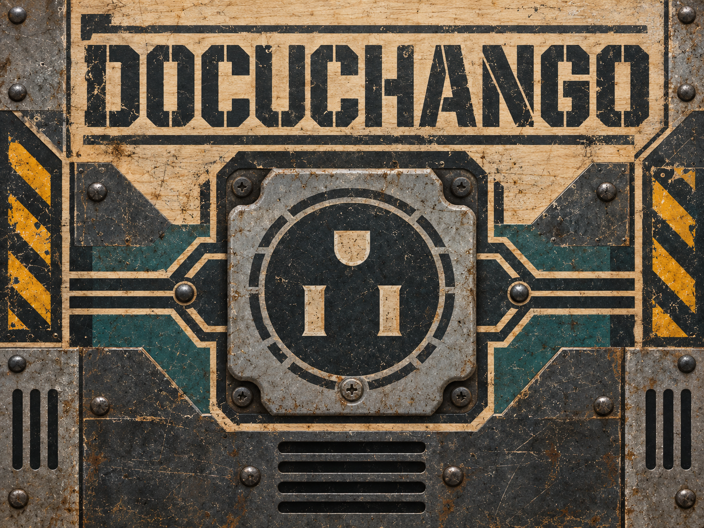

# Docuchango

[](https://pypi.org/project/docuchango/)
[](https://github.com/jrepp/docuchango/actions)
[](https://codecov.io/gh/jrepp/docuchango)
[](https://www.python.org/downloads/)
[](https://opensource.org/licenses/MPL-2.0)



Docuchango keeps a folder of engineering documents valid. Give it a `docs-cms/`
directory of ADRs, RFCs, memos and PRDs, and it checks the frontmatter against
a schema, verifies every link, cleans up the Markdown, and fixes what it can
without asking. It is built for repositories where humans and coding agents
write documentation together and need it to stay trustworthy.

- **Structured by default.** Every document has an id, a status, tags and a
  UUID, enforced by Pydantic schemas per document type.
- **Fixes, not just findings.** Whitespace, code fences, dates, tags and
  missing fields are repaired in place. What it cannot fix, it reports.
- **Agent-ready.** Ships a guide that tells coding agents how to read,
  cite and extend the docs. Point `AGENTS.md` at it and you are done.
- **Fast and CI-friendly.** A hundred documents validate in under a second,
  with exit codes that work in pre-commit hooks and pull request checks.

## Two-minute start

You need Python 3.10 or newer. With [uv](https://docs.astral.sh/uv/) nothing
else has to be installed:

```bash
# 1. Create the folder structure, config and templates
uvx docuchango init --project-id my-app --project-name "My App"

# 2. Write your first decision record from the template
cp docs-cms/templates/adr-000-template.md docs-cms/adr/adr-001-adopt-docs-cms.md
#    ...edit the frontmatter and body...

# 3. Check it, then let it repair what it can
uvx docuchango validate --dry-run
uvx docuchango validate
```

Prefer a permanent install? `pip install docuchango` or
`uv tool install docuchango` gives you the `docuchango` command directly.

`init` creates this layout:

```text
docs-cms/
├── docs-project.yaml         # project config (id, folders, rules)
├── docs-project.schema.json  # editor validation for the config
├── README.md
├── adr/                      # Architecture Decision Records
├── rfcs/                     # Requests for Comments
├── memos/                    # Findings, plans, status notes
├── prd/                      # Product Requirements Documents
└── templates/                # adr-000, rfc-000, memo-000, prd-000
```

A validation run looks like this:

```text
$ docuchango validate --dry-run

🔍 Validating Documentation
DRY RUN - No changes will be made

Scanned 12 files

✗ Remaining issues: 2
  docs-cms/adr/adr-004-event-bus.md
    • ID mismatch: frontmatter has 'adr-003' but filename suggests 'adr-004'
    • Line 53: Broken link './adr-002-example.md' - File not found

❌ Validation failed
```

Run it again without `--dry-run` and the fixable problems disappear. The two
above need a human, so they stay in the report.

## What a document looks like

Every file is Markdown with a YAML frontmatter block. This is a complete ADR
header:

```yaml
---
id: adr-001                 # lowercase, matches the filename
title: Adopt docs-cms
status: Accepted            # ADR: Proposed, Accepted, Implemented, Deprecated, Superseded
created: 2026-09-14
deciders: Platform Team
tags: [documentation, process]
project_id: my-app          # from docs-project.yaml
doc_uuid: 7c9e6679-7425-40de-944b-e07fc1f90ae7   # generate once, never change
---
```

Each type adds a field or two:

| Type | Folder | Extra required fields | Status values |
|------|--------|----------------------|---------------|
| ADR  | `adr/`   | `deciders` | Proposed, Accepted, Implemented, Deprecated, Superseded |
| RFC  | `rfcs/`  | `author`   | Draft, Proposed, Accepted, Implemented, Deprecated, Superseded |
| Memo | `memos/` | `author`   | none required |
| PRD  | `prd/`   | `author`, `target_release` | Draft, In Review, Approved, In Progress, Completed, Cancelled |

Generate a UUID with `uuidgen | tr '[:upper:]' '[:lower:]'` or
`python -c "import uuid; print(uuid.uuid4())"`.

## Everyday commands

| Command | What it does |
|---------|--------------|
| `docuchango init` | Create `docs-cms/` with config, schema and templates |
| `docuchango validate` | Check every document and fix what can be fixed |
| `docuchango validate --dry-run` | Report only, change nothing |
| `docuchango validate --verbose` | Show every check, useful in CI logs |
| `docuchango bulk update --type adr --set status=Accepted` | Change a frontmatter field across many documents |
| `docuchango bulk timestamps` | Derive `created` dates from git history |
| `docuchango migrate --project-id my-app` | Upgrade legacy frontmatter to the current schema |
| `docuchango bootstrap` | Print the setup guide; `--guide agent` prints the agent guide |

Every command that changes files accepts `--dry-run`. `dcc-validate` is a
short alias for `docuchango validate`.

## Working with coding agents

Docuchango treats `docs-cms/` as the project's durable memory. Tell your
agents the same thing by adding an `AGENTS.md` at the repository root:

```markdown
# Agent Instructions

Use `docs-cms/` as durable project memory. Read the relevant ADRs, RFCs,
PRDs and memos before changing architecture, schemas or process.

Record new durable knowledge as a docs-cms document, not as loose notes.
ADRs for decisions, RFCs for proposals, PRDs for requirements, memos for
findings. Do not mark an agent-authored decision `Accepted` without explicit
human approval; use `Proposed` or write a memo.

After editing docs-cms, run `docuchango validate` and report anything it
could not fix.
```

The full agent guide covers searching, citing and proposing documents. Print
it with `docuchango bootstrap --guide agent`, or read
[docs/AGENT_GUIDE.md](docs/AGENT_GUIDE.md).

## Validate in CI

```yaml
name: Validate docs
on:
  pull_request:
    paths: ['docs-cms/**']
jobs:
  validate:
    runs-on: ubuntu-latest
    steps:
      - uses: actions/checkout@v4
        with:
          fetch-depth: 0   # git history lets docuchango derive timestamps
      - uses: astral-sh/setup-uv@v8
      - run: uvx docuchango validate --dry-run --verbose
```

Use `--dry-run` in CI so a pull request fails on problems instead of being
silently rewritten. Run the fixing form locally or in a pre-commit hook.

## Going further

- [Bootstrap guide](docs/BOOTSTRAP_GUIDE.md): step-by-step setup for a new or
  existing repository, document types, status flows, troubleshooting.
- [Configuration](docs/CONFIGURATION.md): monorepos, multiple doc roots,
  mixed schemas, naming standards, index files, readability thresholds.
- [Validation reference](docs/VALIDATION_REFERENCE.md): everything docuchango
  detects, what it fixes automatically, and what it leaves to you.
- [Agent guide](docs/AGENT_GUIDE.md) and
  [Best practices](docs/BEST_PRACTICES.md): how agents should read, cite and
  extend a docs-cms.
- [Templates](templates/) and a complete [example docs-cms](examples/docs-cms/).
- [Docuchango's own docs-cms](docs-cms/): the decisions behind the tool.

## Python API

```python
from docuchango.validator import DocValidator
from docuchango.schemas import ADRFrontmatter

validator = DocValidator(repo_root=".", verbose=True)
validator.scan_documents()
validator.check_code_blocks()
validator.check_formatting()

adr = ADRFrontmatter(**frontmatter_data)
```

## Development

```bash
uv sync                      # install with dev dependencies
uv run pytest                # tests
uv run pytest --cov=docuchango
uv run ruff format . && uv run ruff check .
uv run mypy docuchango tests
actionlint                   # GitHub Actions workflows
uv build
```

Releases are automated from conventional commits. See
[PUBLISHING.md](PUBLISHING.md).

## Requirements

- Python 3.10 to 3.15
- macOS, Linux or Windows

## License

Mozilla Public License 2.0. See [LICENSE](LICENSE).

## Links

- [GitHub](https://github.com/jrepp/docuchango)
- [PyPI](https://pypi.org/project/docuchango)
- [Issues](https://github.com/jrepp/docuchango/issues)
